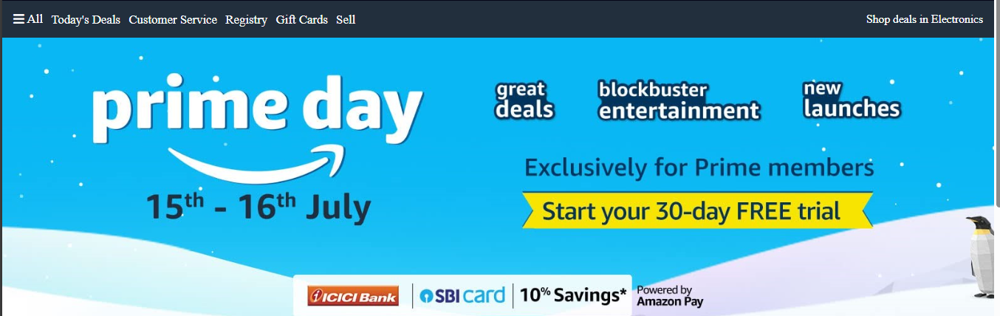
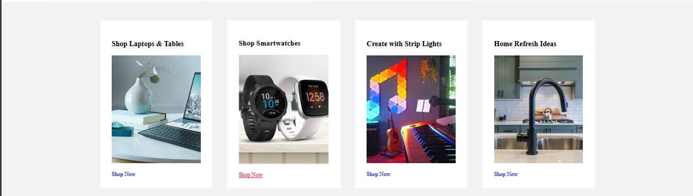
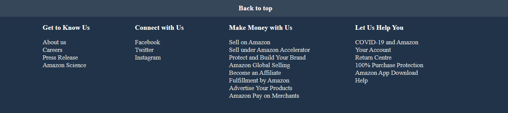

Hosted Link:- https://pankajkumardhal.github.io/amazon-clone/

# Project Overview

This project is a static HTML page designed to mimic the Amazon website layout. The page includes a header with a navigation bar, a banner, product cards, and a footer section. This document provides detailed explanations of each part of the HTML along with the CSS properties used to style them.

## Table of Contents

1. [Header Section](#header-section)
2. [Banner Section](#banner-section)
3. [Cards Section](#cards-section)
4. [Footer Section](#footer-section)

## Header Section

The header section includes the navigation bar with the logo, address, search bar, sign-in link, returns link, and cart icon.

### Explanation

- **Logo:** Positioned on the left, links to the homepage.
- **Address Section:** Displays delivery location with a map icon.
- **Search Bar:** Includes a dropdown for category selection, a text input for search, and a search icon button.
- **Sign-in Link:** Greets the user and provides access to account and lists.
- **Returns Link:** Allows users to view their orders and returns.
- **Cart Icon:** Displays the shopping cart, positioned on the right.

## Banner Section

The banner section includes a promotional banner with links and a background image.

### Explanation

- **Panel:** Contains a menu icon and "All" link.
- **Links:** Provides quick access to popular sections like Today's Deals, Customer Service, Registry, Gift Cards, and Sell.
- **Deals:** Highlights specific promotional deals, such as "Shop deals in Electronics".

## Cards Section

The cards section displays four different product categories, each with an image and a "Shop Now" link.

### Explanation

- **Card 1:** Promotes laptops and tablets with an image and a "Shop Now" link.
- **Card 2:** Highlights smartwatches with an image and a "Shop Now" link.
- **Card 3:** Showcases strip lights for creative projects with an image and a "Shop Now" link.
- **Card 4:** Features home refresh ideas with an image and a "Shop Now" link.

## Footer Section

The footer section includes links to various informational pages and resources.

### Explanation

- **Back to Top Link:** Provides a quick way to scroll back to the top of the page.
- **Information Links:** 
  - **Get to Know Us:** About us, Careers, Press Release, Amazon Science.
  - **Connect with Us:** Links to social media platforms like Facebook, Twitter, Instagram.
  - **Make Money with Us:** Selling on Amazon, Amazon Accelerator, Global Selling, Affiliate programs, Advertising.
  - **Let Us Help You:** COVID-19 information, Account management, Return Center, Purchase Protection, App Download, Help section.
